# Prism

**A Netflix-style front end for your own Plex library — on your TV, your phone, your Xbox, and your browser.**

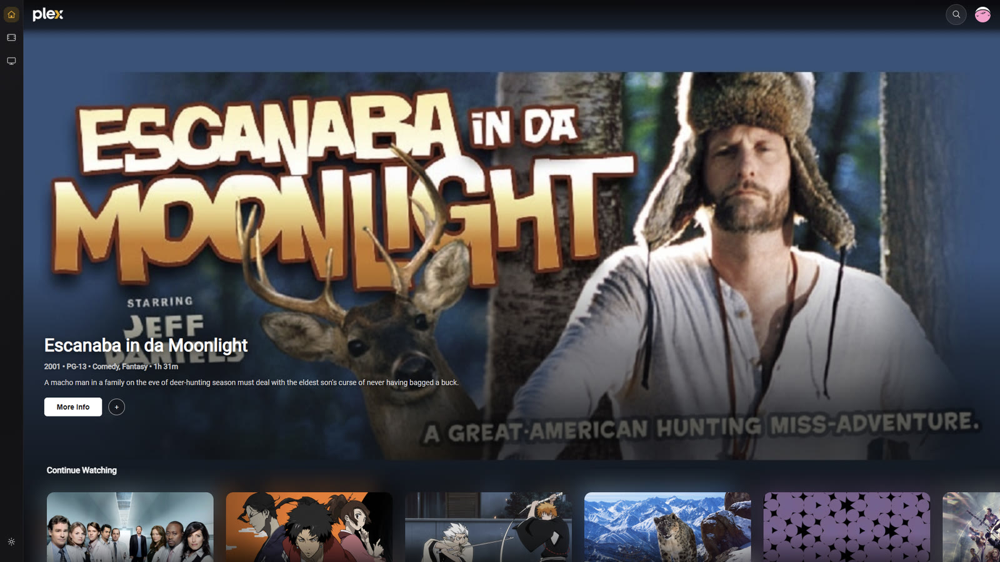

---

## What is this?

Prism is a media browsing app that sits on top of a [Plex](https://www.plex.tv/) server you
already own. It doesn't host, stream, or provide any content of its own — it just gives your
existing library the kind of front end you'd expect from a paid streaming service:

- a big cinematic hero banner that cycles through your titles, with trailers
- rows of artwork you scroll sideways — *Continue Watching*, *Recently Added*, *My List*, genre rows
- a details page with cast, ratings, and recommendations
- a full-featured player with chapters, subtitles, and picture-quality controls

If you have a Plex server full of movies and shows and you want browsing it to *feel* like
Netflix instead of feeling like a file manager, that's what this is for.

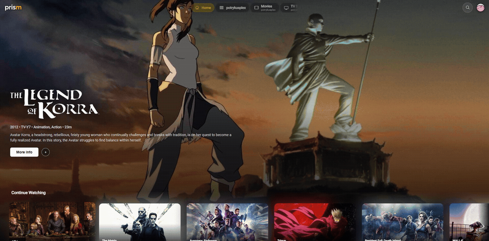

---

## Why it exists

Plex's own apps are fine, but they're built to sell you Plex's catalog as much as show you
yours. Prism is deliberately narrow: **your library, nothing else.** No storefront, no ads for
things you don't own, no channels you didn't ask for.

It's also built for the living room first. Everything is reachable with a **controller or a
remote's arrow keys** — not just a mouse — and the player is tuned for actually watching things: quality
that adapts to your connection, chapter skipping, subtitle search, and picture enhancement for
older or lower-resolution files.

---

## A look around

### Rows of your own artwork

Your libraries become rows. Genre rows are generated from your library's own tags, and if you
plug in an (optional) AI key, Prism will also invent themed rows like *"Sci-Fi Comedies"* and
fill them from titles you actually own.

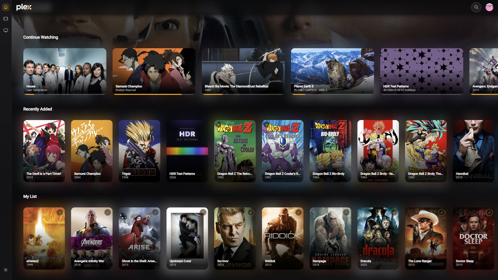

### Per-library views

Each Plex library gets its own tab down the left side, named however you named it in Plex.

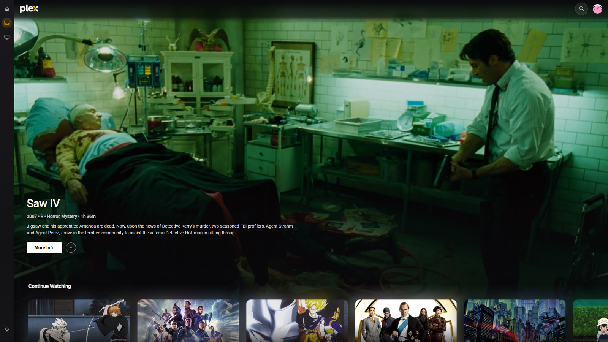

### Search that understands your library

One search box across movies, shows, individual episodes, and collections.

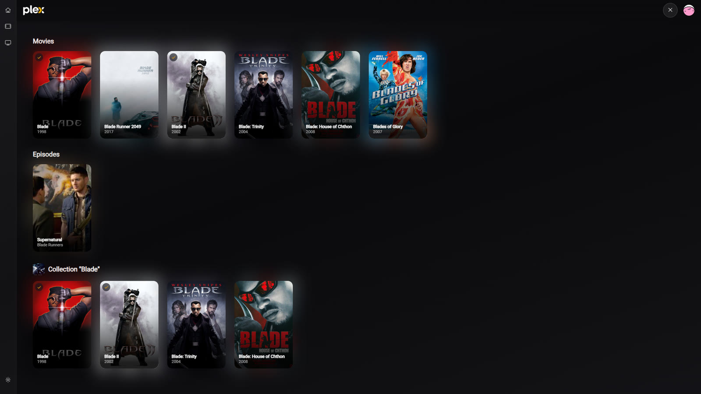

### Details without leaving the page

Picking a poster opens an overlay — synopsis, cast, ratings, similar titles, and a play button.
No page loads, no losing your place.

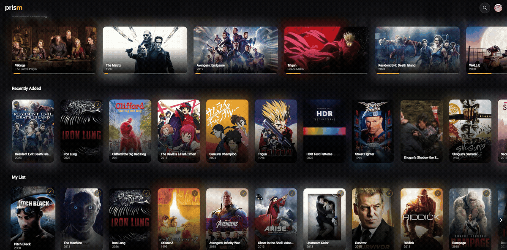

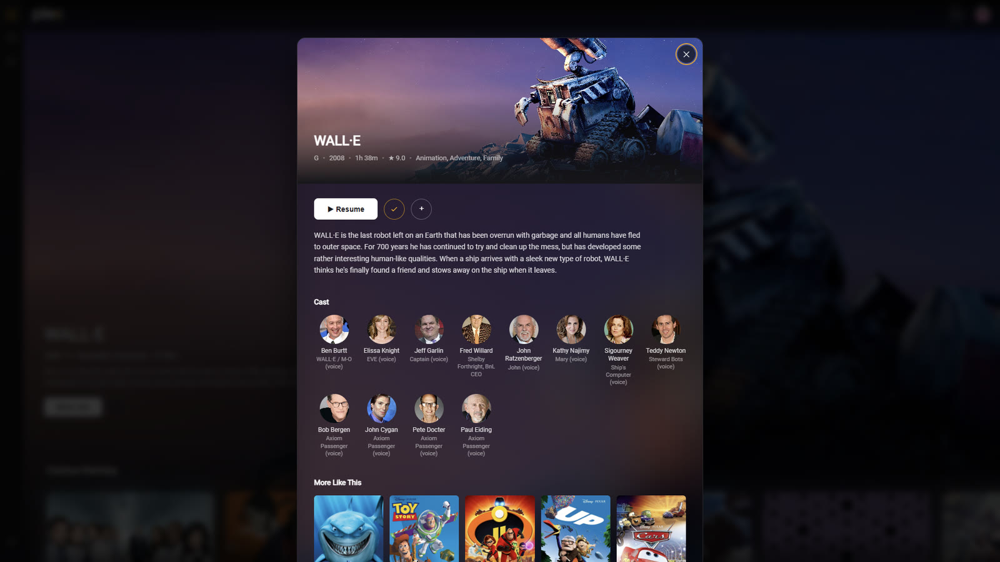

---

## The player

One play button, and then everything you'd want mid-film — controls fade away while you watch
and come back when you move.

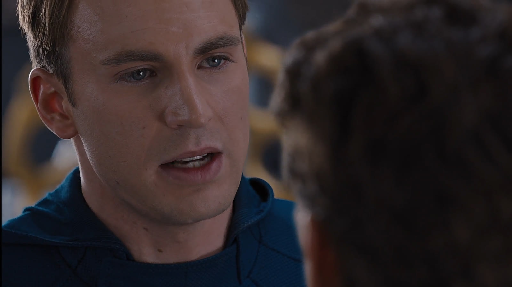

Everything else lives behind one menu, so nothing clutters the picture.

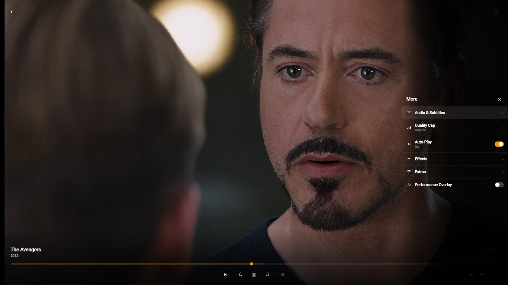

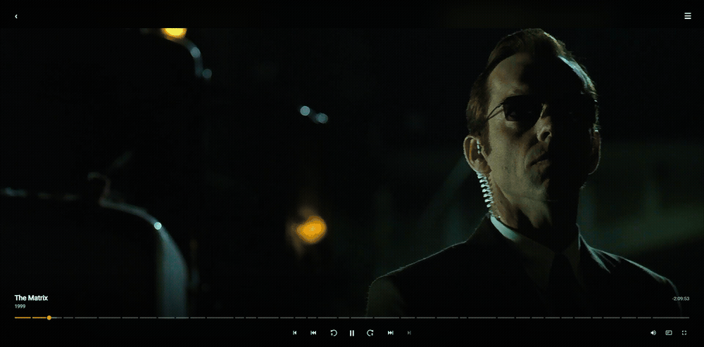

### Chapters

Jump by chapter, with real thumbnails pulled from the file itself.

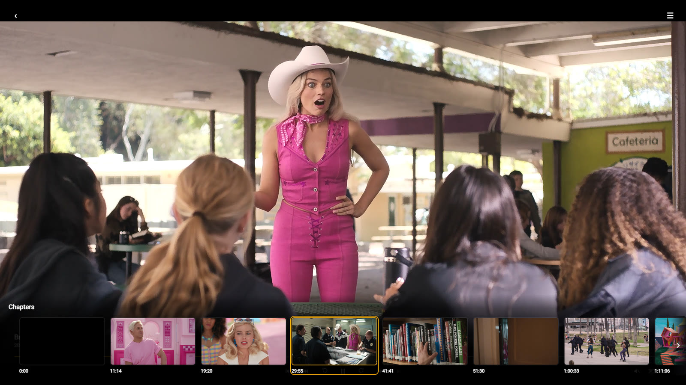

### Episodes and up next

Pick the next episode without leaving playback — and if you'd rather not, Prism plays it
automatically when the credits roll.

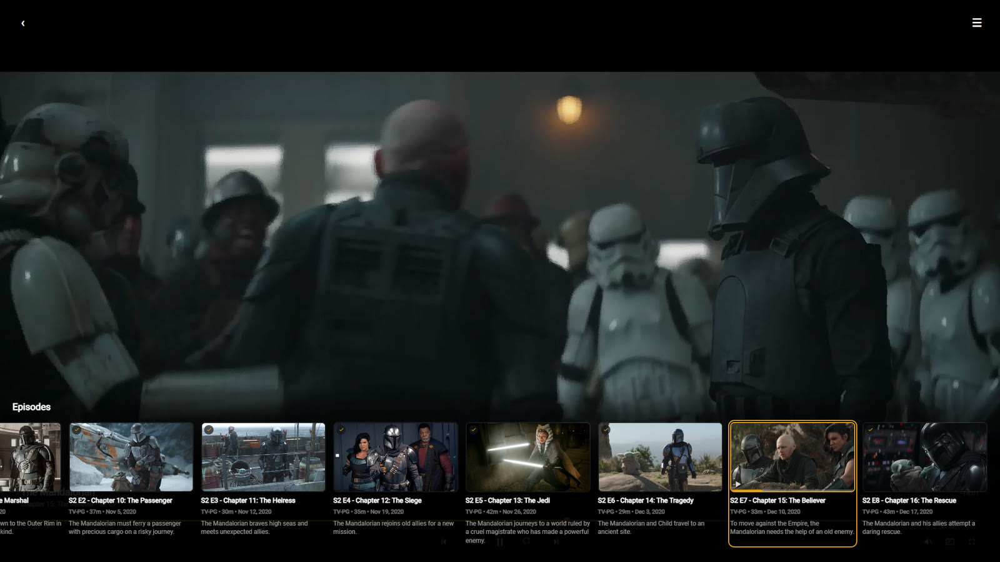

### Audio and subtitles

Switch audio tracks, or search for and load subtitles mid-film without hunting for files.

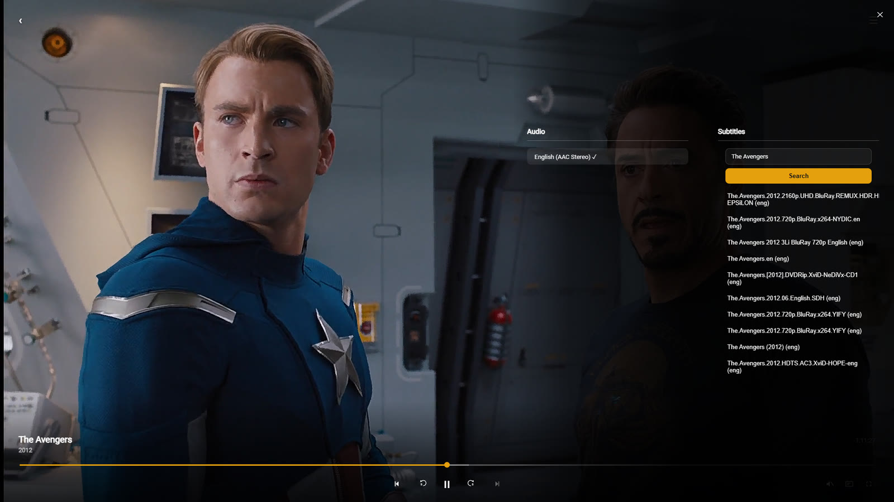

### Picture quality, in plain terms

- **Quality** — Prism watches your actual connection speed and picks a stream that won't stall.
  You can also pin it manually, or force the original file.
- **AI upscaling** — for older or low-resolution files, Prism can rebuild detail on the fly
  using real upscaling shaders (Anime4K for animation, AMD FSR for live action). It switches
  itself off when the file already matches your screen, so it never runs for nothing.
- **Sharpening and color boost** — subtle, optional, adjustable.
- **Ambient lighting** — spills the colors at the edge of the picture out into the black bars
  around it, so a widescreen film doesn't sit in a hard black box.
- **HDR** — HDR files play as HDR on hardware that supports it.

---

## Setting it up

The only thing Prism needs to know is *which Plex server is yours*. You sign in with your Plex
account the same way you would in any Plex app — a short code, no passwords typed on a TV
remote — and Prism finds your server and libraries for you.

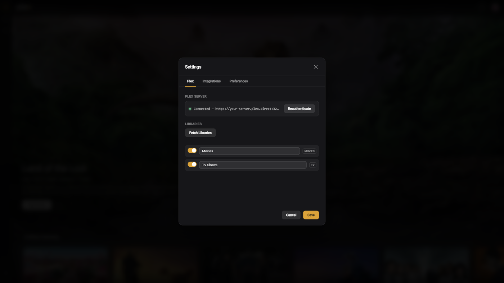

Everything else is optional:

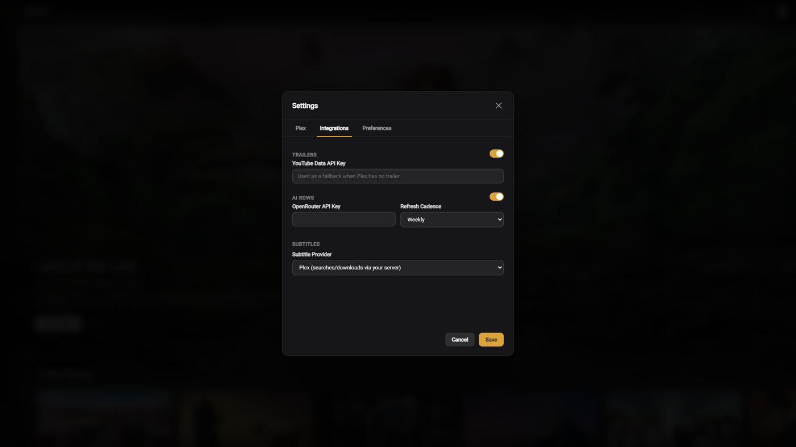

| Optional | What it adds |
|---|---|
| **YouTube API key** | Trailers for titles where Plex doesn't have one |
| **OpenRouter API key** | AI-generated themed rows, refreshed weekly |
| **Subtitle provider** | Where subtitle searches come from |

If you share a Plex server with family, Prism also picks up your **Plex Home profiles** — switch
between them from the sidebar, with a PIN prompt for the profiles that have one.

---

## Where it runs

| | Status |
|---|---|
| **Web browser** (desktop or phone) | Works today |
| **Android** (phone and tablet) | Works today, with a native player for smooth full-quality playback |
| **Xbox** | Works today via developer sideloading, with a native player for HDR and high-bitrate files |
| **Android TV / Fire TV** | Not yet — the Android app runs, but it isn't set up as a TV app |

Input-wise: mouse and touch, keyboard, and Xbox controllers all navigate the whole app. TV
remotes send the same arrow/select/back keys, so they should work too — that just hasn't been
tested on real remote hardware yet.

---

## How to install it

> **⏳ Not yet.** There are no downloads or releases published yet — no APK, no Xbox package, no
> hosted web build. This section will be filled in once the first builds are out.
>
> If you're a developer and want to build it yourself in the meantime, the short version is
> `npm install` then `npm run dev` for the browser, `npm run android` for Android, and
> `npm run xbox:build` for Xbox. Everything else lives in `CLAUDE.md`.

---

## Things worth knowing

- **Prism does not give you anything to watch.** It's a viewer for a Plex server that you run,
  containing media that you supply. No server, no Prism.
- **It talks straight to your Plex server.** There's no Prism cloud, no extra account to make, and
  nothing about your library leaves your network except what you explicitly enable (trailer
  lookups, AI rows, subtitle searches).
- **It is not affiliated with Plex Inc.** It's an independent app that uses Plex's public API.
- **It's a personal project**, built and tested against one real library on real hardware. It
  works well there; expect rough edges elsewhere.

---

## License

[MIT](LICENSE)

Screenshots show a personal Plex library. Artwork, posters, and video frames belong to their
respective rights holders and are shown here only to illustrate the interface.
